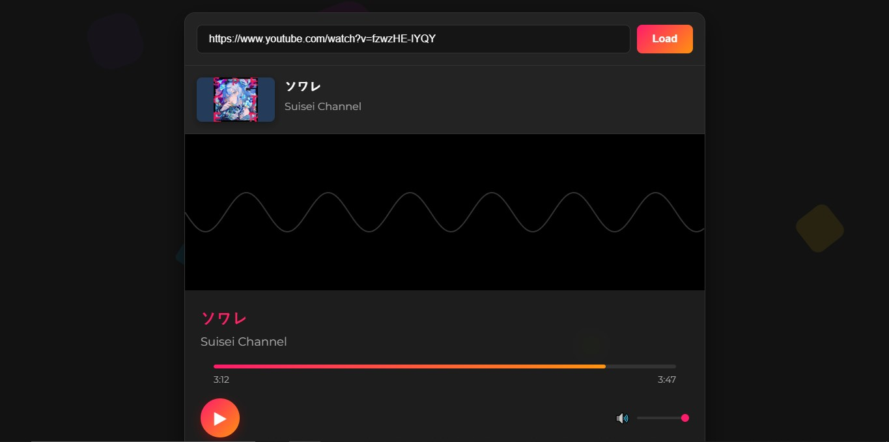
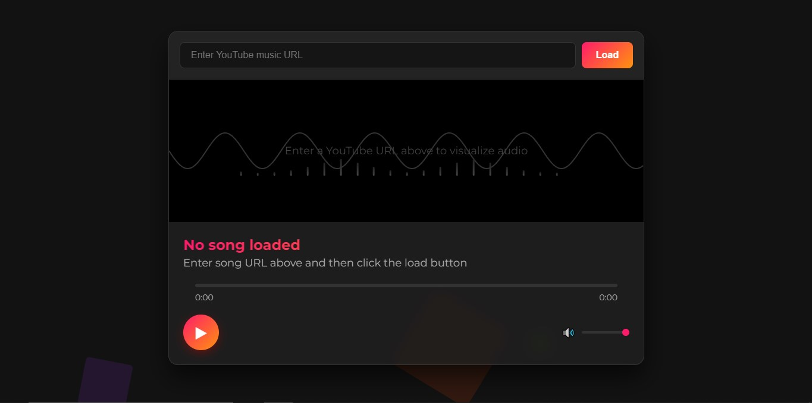

# yt-audio-visualizer
Visualizing music/audio from youtube URL. Using yt-dlp to temporarily download the audio, you need to install yt-dlp on your system first. Generated by Claude.

How to run:
- open the src folder, run npm install, and run node server.js
- open the public folder, open index.html
- Enjoy!

Disclaimer

This web application is provided solely for educational purposes.  It is designed to demonstrate the capabilities of web technologies, including but not limited to HTML5 Audio, the Web Audio API, client-side JavaScript, and server-side audio processing using Node.js and related libraries (yt-dlp, express).  It is not intended for, nor should it be used as, a primary means of downloading or distributing copyrighted content.

The ability to download and convert audio from YouTube videos, as demonstrated by this project, may violate YouTube's Terms of Service.  Specifically, unauthorized downloading of content is generally prohibited.  By using this application, you acknowledge that you have read, understood, and agree to be bound by YouTube's Terms of Service (available at https://www.youtube.com/t/terms) and any applicable copyright laws and regulations in your jurisdiction.

User Responsibility:

You, as the user, bear full and sole responsibility for your use of this application. This includes, but is not limited to:

1.  Complying with YouTube's Terms of Service: You must not use this application in any way that violates YouTube's rules.
2.  Respecting Copyright Laws:  You must not use this application to download, convert, or distribute copyrighted material without the express permission of the copyright holder.  This includes music, videos, and any other content protected by copyright.  Infringement of copyright may carry significant legal penalties.
3.  Understanding Local Laws:  Copyright and digital content laws vary by country.  You are responsible for knowing and adhering to the laws of your region.
4.  Avoiding Misuse:  This application should not be used for any commercial purposes, including but not limited to selling, distributing, or otherwise profiting from downloaded content.  It should not be used to create derivative works without proper authorization.

Non-Affiliation:

This project is an independent creation and is in no way affiliated with, endorsed by, sponsored by, or otherwise associated with YouTube, Google, or any of their subsidiaries or affiliates.  All trademarks and copyrights associated with YouTube and its content remain the exclusive property of their respective owners.  The use of the YouTube name and any related imagery within this project's code and interface is solely for the purpose of demonstrating technical functionality, not to imply any endorsement or partnership.

No Warranty; Limitation of Liability:

This application is provided "as is," without warranty of any kind, express or implied.  The developers of this project make no guarantees about its functionality, reliability, or suitability for any particular purpose.  The developers shall not be held liable for any damages, direct or indirect, arising from the use of this application, including but not limited to:

*   Legal penalties resulting from copyright infringement.
*   Violations of YouTube's Terms of Service.
*   Data loss or corruption.
*   Any other consequences resulting from the use or misuse of this application.

By using this application, you acknowledge and agree to all of the terms and conditions outlined in this disclaimer. If you do not agree with these terms, you must not use this application.  If you have any questions or concerns about copyright or the legality of using this application, it is strongly recommended that you seek legal counsel.

This disclaimer is subject to change without notice. It is your responsibility to review it periodically.
